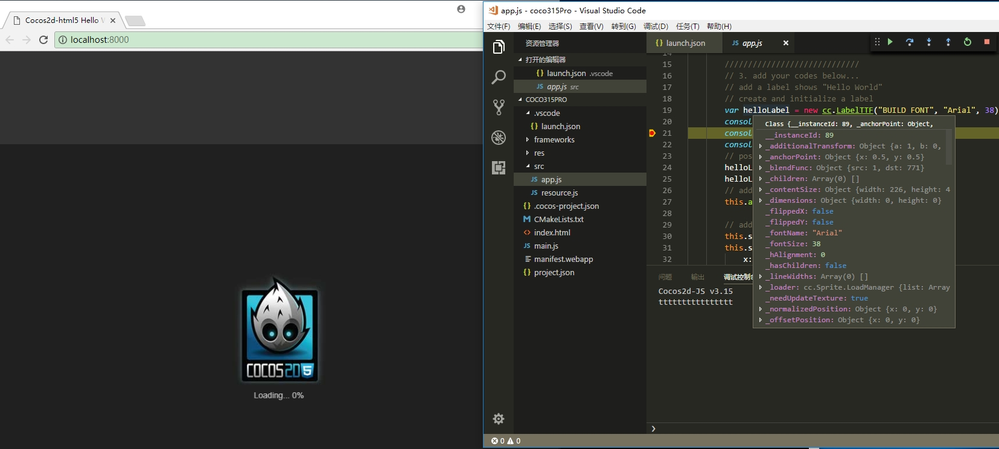

#### 1.准备阶段

1. 具备调试功能的VSCode(我的是在win10上，版本是1.17.1)
2. 在VSCode里下载安装Debugger for Chrome扩展插件。

#### 2.具体操作

1. 创建一个cocosjs工程 cocos new coco315Pro -l js -d 你的路径 -p 包名

2. 使用VSCode打开这个工程。  Ctrl + o

3. 由于cocosjs会加载json文件，所以需要把他部署到一个本地服务器上。我用nodejs创建了一个简单的http服务器，但是不好使，虽然index.html会正常发到浏览器上，但是脚本加载的时候会报unexpected token <的错误。我记得cocos提供的命令cocos run -p web会先启动一个本地服务器，所以通过查阅cocos.py,定位到引擎目录下的tools/cocos2d-console/plugins/plugin_run下的project_run.py里使用BaseHTTPServer创建了一个本地的http服务器。同时打开浏览器，访问127.0.0.1:8000。

   ```javascript
    def run_web(self, dependencies):
           if not self._platforms.is_web_active():
               return

           from SimpleHTTPServer import SimpleHTTPRequestHandler
           HandlerClass = SimpleHTTPRequestHandler
           ServerClass  = BaseHTTPServer.HTTPServer
           Protocol     = "HTTP/1.0"
           HandlerClass.protocol_version = Protocol

           host = self._host
           if self._port is None:
               port = 8000
               port_max_add = 2000
           else:
               port = int(self._port)
               port_max_add = 0

           deploy_dep = dependencies['deploy']
           run_root = deploy_dep.run_root

           i = 0
           httpd = None
           while (i <= port_max_add):
               port += i
               i += 1
               server_address = (host, port)
               try:
                   cocos.Logging.info(MultiLanguage.get_string('RUN_INFO_HOST_PORT_FMT', (host, port)))
                   httpd = ServerClass(server_address, HandlerClass)
               except Exception as e:
                   httpd = None
                   cocos.Logging.warning(MultiLanguage.get_string('RUN_WARNING_SERVER_FAILED_FMT', (host, port, e)))

               if httpd is not None:
                   break

           if httpd is None:
               raise cocos.CCPluginError(MultiLanguage.get_string('RUN_ERROR_START_SERVER_FAILED'),
                                         cocos.CCPluginError.ERROR_OTHERS)

           # from threading import Thread
           # sub_url = deploy_dep.sub_url
           # url = 'http://%s:%s%s' % (host, port, sub_url)
           # thread = Thread(target = self.open_webbrowser, args = (url,))
           # thread.start()

           sa = httpd.socket.getsockname()
           with cocos.pushd(run_root):
               cocos.Logging.info(MultiLanguage.get_string('RUN_INFO_SERVING_FMT', (sa[0], sa[1])))
               httpd.serve_forever()
   ```

   ​

4. 我们把启动浏览器的代码注释掉:

   ```javascript
      # from threading import Thread
      # sub_url = deploy_dep.sub_url
      # url = 'http://%s:%s%s' % (host, port, sub_url)
      # thread = Thread(target = self.open_webbrowser, args = (url,))
      # thread.start()
   ```

   这样我们以后输入命令cocos run -p web就只会开启http服务。

5. 点击VSCode左边栏的Debug图标(甲虫图案),自动弹出一个launch.json文件让你配置。可以参考https://go.microsoft.com/fwlink/?linkid=830387。

   我是这样配置的:

   ```javasc
   {
       "version": "0.2.0",
       "configurations": [
           {
               "name": "Launch localhost",
               "type": "chrome",
               "request": "launch",
               "url": "http://localhost:8000",
               "sourceMaps": true,
               "webRoot": "${workspaceRoot}"
           }
       ]
   }
   ```

#### 3.开始调试

1. 我们先在cmd里输入：

   ```javasc
   cocos run -p web
   ```

   打开本地服务器。

2. 然后你就可以打断点,F5调试了。




等我再详细看一下nodejs，看怎么解决那个问题。不过WebStorm还有chrome的开发者工具都是拿来就能调试cocos2d js项目，比较方便。工作中，我基本是用sublime比较多，不过我感觉vscode以后怕是要取代sublime了。

```javasc

```

